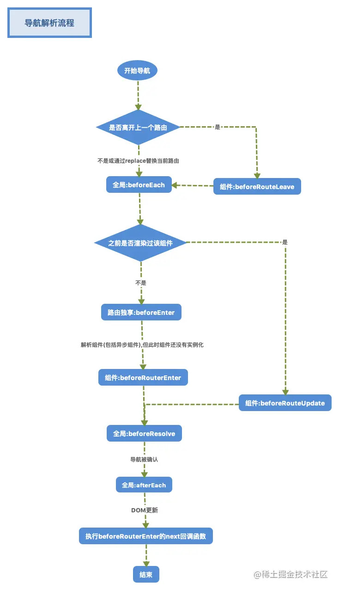

## Vue 面试专题

### 简述MVVM

**什么是MVVM？**

`视图模型双向绑定`，是`Model-View-ViewModel`的缩写，也就是把`MVC`中的`Controller`演变成`ViewModel`。`Model`层代表数据模型，`View`代表UI组件，`ViewModel`是`View`和`Model`层的桥梁，数据会绑定到`viewModel`层并自动将数据渲染到页面中，视图变化的时候会通知`viewModel`层更新数据。以前是操作DOM结构更新视图，现在是`数据驱动视图`。

**MVVM的优点：**

1. `低耦合`：视图（View）可以独立于Model变化和修改，一个Model可以绑定到不同的View上，当View变化的时候Model可以不变化，当Model变化的时候View也可以不变
2. `可重用性`：你可以把一些视图逻辑放在一个Model里面，让很多View重用这段视图逻辑
3. `独立开发`：开发人员可以专注于业务逻辑和数据的开发(ViewModel)，设计人员可以专注于页面设计
4. `可测试`

### Vue底层实现原理

vue.js是采用数据劫持结合发布者-订阅者模式的方式，通过Object.defineProperty()来劫持各个属性的setter和getter，在数据变动时发布消息给订阅者，触发相应的监听回调\
Vue是一个典型的MVVM框架，模型（Model）只是普通的javascript对象，修改它则视图（View）会自动更新。这种设计让状态管理变得非常简单而直观

**Observer（数据监听器）：** Observer的核心是通过Object.defineProprtty()来监听数据的变动，这个函数内部可以定义setter和getter，每当数据发生变化，就会触发setter。这时候Observer就要通知Watcher

**Watcher（订阅者）：**  Watcher作为Observer和Compile之间通信的桥梁，主要做的事情是：

1. 在自身实例化时往属性订阅器(dep)里面添加自己
1. 自身必须有一个update()方法
1. 待属性变动dep.notice()通知时，能调用自身的update()方法，并触发Compile中绑定的回调

**Compile（指令解析器）：** Compile主要做的事情是解析模板指令，将模板中变量替换成数据，然后初始化渲染页面视图，并将每个指令对应的节点绑定更新函数，添加鉴定数据的订阅者，一旦数据有变动，收到通知，更新视图

传送门：☞ [20分钟吃透Diff算法核心原理](https://juejin.cn/post/6994959998283907102#heading-2)


### 谈谈对vue生命周期的理解

每个`Vue`实例在创建时都会经过一系列的初始化过程，`vue`的生命周期钩子，就是说在达到某一阶段或条件时去触发的函数，目的就是为了完成一些动作或者事件

-   `create阶段`：vue实例被创建\
    `beforeCreate`：最初调用触发，创建前，此时data和methods中的数据都还没有初始化，data和events都不能用\
    `created`：创建完毕，data中有值，未挂载，data和events已经初始化好，data已经具有响应式；在这里可以发送请求
-   `mount阶段`：vue实例被挂载到真实DOM节点\
    `beforeMount`：在模版编译之后，渲染之前触发，可以发起服务端请求，去数据，ssr中不可用，基本用不上这个hook\
    `mounted`：在渲染之后触发，此时可以操作DOM，并能访问组件中的DOM以及$ref,ssr中不可用
-   `update阶段`：当vue实例里面的data数据变化时，触发组件的重新渲染\
    `beforeUpdate`：更新前，在数据变化后，模版改变前触发，切勿使用它监听数据变化\
    `updated`：更新后，在数据改变后，模版改变后触发，常用于重渲染案后的打点，性能检测或触发vue组件中非vue组件的更新
-   `destroy阶段`：vue实例被销毁\
    `beforeDestroy`：实例被销毁前，组件卸载前触发，此时可以手动销毁一些方法，可以在此时清理事件、计时器或者取消订阅操作\
    `destroyed`：卸载完毕后触发，销毁后，可以做最后的打点或事件触发操作

#### 组件生命周期

**生命周期（父子组件）** 父组件beforeCreate --> 父组件created --> 父组件beforeMount --> 子组件beforeCreate --> 子组件created --> 子组件beforeMount --> 子组件 mounted --> 父组件mounted --> 父组件beforeUpdate --> 子组件beforeDestroy --> 子组件destroyed --> 父组件updated

**加载渲染过程** 父组件beforeCreate --> 父组件created --> 父组件beforeMount --> 子组件beforeCreate --> 子组件created --> 子组件beforeMount --> 子组件mounted --> 父组件mounted

**挂载阶段** 父组件created --> 子组件created --> 子组件mounted --> 父组件mounted

**父组件更新阶段** 父组件beforeUpdate --> 父组件updated

**子组件更新阶段** 父组件beforeUpdate --> 子组件beforeUpdate --> 子组件updated --> 父组件updated

**销毁阶段** 父组件beforeDestroy --> 子组件beforeDestroy --> 子组件destroyed --> 父组件destroyed

### computed与watch

通俗来讲，既能用 computed 实现又可以用 watch 监听来实现的功能，推荐用 computed， 重点在于 computed 的缓存功能 computed 计算属性是用来声明式的描述一个值依赖了其它的值，当所依赖的值或者变量 改变时，计算属性也会跟着改变； watch 监听的是已经在 data 中定义的变量，当该变量变化时，会触发 watch 中的方法。

**watch 属性监听**  
是一个对象，键是需要观察的属性，值是对应回调函数，主要用来监听某些特定数据的变化，从而进行某些具体的业务逻辑操作,监听属性的变化，需要在数据变化时执行异步或开销较大的操作时使用

**computed 计算属性**  
属性的结果会被`缓存`，当`computed`中的函数所依赖的属性没有发生改变的时候，那么调用当前函数的时候结果会从缓存中读取。除非依赖的响应式属性变化时才会重新计算，主要当做属性来使用 `computed`中的函数必须用`return`返回最终的结果 `computed`更高效，优先使用。`data 不改变，computed 不更新。`

**使用场景**  
`computed`：当一个属性受多个属性影响的时候使用，例：购物车商品结算功能  
`watch`：当一条数据影响多条数据的时候使用，例：搜索数据

#### 组件中的data为什么是一个函数？

1. 一个组件被复用多次的话，也就会创建多个实例。本质上，这些实例用的都是同一个构造函数。
2. 如果data是对象的话，对象属于引用类型，会影响到所有的实例。所以为了保证组件不同的实例之间data不冲突，data必须是一个函数。

#### 为什么v-for和v-if不建议用在一起

1. 当 v-for 和 v-if 处于同一个节点时，v-for 的优先级比 v-if 更高，这意味着 v-if 将分别重复运行于每个 v-for 循环中。如果要遍历的数组很大，而真正要展示的数据很少时，这将造成很大的性能浪费 
2. 这种场景建议使用 computed，先对数据进行过滤

注意：3.x 版本中 `v-if` 总是优先于 `v-for` 生效。由于语法上存在歧义，建议避免在同一元素上同时使用两者。比起在模板层面管理相关逻辑，更好的办法是通过创建计算属性筛选出列表，并以此创建可见元素。

解惑传送门 ☞ [# v-if 与 v-for 的优先级对比非兼容](https://v3.cn.vuejs.org/guide/migration/v-if-v-for.html#%E6%A6%82%E8%A7%88)

### React/Vue 项目中 key 的作用

-   key的作用是为了在diff算法执行时更快的找到对应的节点，`提高diff速度，更高效的更新虚拟DOM`

    vue和react都是采用diff算法来对比新旧虚拟节点，从而更新节点。在vue的diff函数中，会根据新节点的key去对比旧节点数组中的key，从而找到相应旧节点。如果没找到就认为是一个新增节点。而如果没有key，那么就会采用遍历查找的方式去找到对应的旧节点。一种一个map映射，另一种是遍历查找。相比而言。map映射的速度更快。

-   为了在数据变化时强制更新组件，以避免`就地复用`带来的副作用

    当 Vue.js 用 `v-for` 更新已渲染过的元素列表时，它默认用“就地复用”策略。如果数据项的顺序被改变，Vue 将不会移动 DOM 元素来匹配数据项的顺序，而是简单复用此处每个元素，并且确保它在特定索引下显示已被渲染过的每个元素。重复的key会造成渲染错误。


### 数组扁平化转换

在说到模版编译的时候，有可能会提到数组的转换，一般就用递归处理
将`[1,2,3,[4,5]]`转换成 

```js
{
  children:[
    {
      value:1
    },
    {
      value:2
    },
    {
      value:3
    },
    {
      children:[
        {
          value:4
        },
        {
          value:5
        }
      ]
    }
  ]
}
```

```js
// 测试数组
let arr =[1,2,3,[4,5]];
// 转换函数
function convert(arr){
  //准备一个接收结果数组
  let result = [];
  // 遍历传入的 arr 的每一项
  for(let i = 0;i < arr.length;i++){
    //如果遍历到的数字是number，直接放进入
    if(typeof arr[i] === 'number'){
      result.push({
        value:arr[i]
      });
    } else if(Array.isArray(arr[i])){
      //如果遍历到这个项目是数组，那么就递归
      result.push({
        children: convert(arr[i])
      });
    }
  }
  return result;
}

let o = convert(arr);
console.log(o);
```

### vue组件的通信方式

- 父子组件通信`props`/`$emit`

-  获取父子组件实例`parent、children`

- 获取实例的方式调用组件的属性或者方法`ref`

- 父->子孙`Provide、inject`官方不推荐使用，但是写组件库时很常用

- `Event Bus`实现跨组件通信 `Vue.prototype.$bus = new Vue()` 自定义事件

- vuex 跨级组件通信

  Vuex、`$attrs、$listeners` `Provide、inject`

### $emit 后面的两个参数是什么

1. 父组件可以使用 props 把数据传给子组件。
2. 子组件可以使用 $emit,让父组件监听到自定义事件 。

`vm.$emit( event, arg );`//触发当前实例上的事件，要传递的参数
`vm.$on( event, fn );`//监听event事件后运行 fn； 

子组件
```vue
<template>
  <div class="train-city">
    <h3>父组件传给子组件的toCity:{{sendData}}</h3> 
    <button @click='select(`大连`)'>点击此处将‘大连’发射给父组件</button>
  </div>
</template>
<script>
  export default {
    name:'trainCity',
    props:['sendData'], // 用来接收父组件传给子组件的数据
    methods:{
      select(val) {
        let data = {
          cityName: val
        };
        this.$emit('showCityName',data);//select事件触发后，自动触发showCityName事件
      }
    }
  }
</script>
```

父组件
```vue
<template>
  <div>
    <div>父组件的toCity{{toCity}}</div>
    <train-city @showCityName="updateCity" :sendData="toCity"><train-city>
  </div>
</template>
<script>
  export default {
    name:'index',
    components: {},
    data () {
      return {
        toCity:"北京"
      }
    },
    methods:{
      updateCity(data){//触发子组件城市选择-选择城市的事件
        this.toCity = data.cityName;//改变了父组件的值
        console.log('toCity:'+this.toCity)
      }
    }
  }
</script>
```

### eventBus 事件总线

```js
// a组件$emit('事件名','事件参数')
// b组件mounted的时候用$on监听并调用要执行的事件
// b组件beforeCreate的时候用$off卸载
const eventHub = new Vue();
Vue.prototype.$bus = {
  $on(...event) {
    eventHub.$on(...event)
  },
  $off(...event) {
    eventHub.$off(...event)
  },
  $emit(...event) {
    eventHub.$emit(...event)
  }
}
```

### nextTick的实现

1.  `nextTick`是`Vue`提供的一个全局`API`,是在下次`DOM`更新循环结束之后执行延迟回调，在修改数据之后使用`$nextTick`，则可以在回调中获取更新后的`DOM`；
1.  Vue在更新DOM时是异步执行的。只要侦听到数据变化，`Vue`将开启1个队列，并缓冲在同一事件循环中发生的所有数据变更。如果同一个`watcher`被多次触发，只会被推入到队列中-次。这种在缓冲时去除重复数据对于避免不必要的计算和`DOM`操作是非常重要的。`nextTick`方法会在队列中加入一个回调函数，确保该函数在前面的dom操作完成后才调用；
1.  比如，我在干什么的时候就会使用nextTick，传一个回调函数进去，在里面执行dom操作即可；
1.  我也有简单了解`nextTick`实现，它会在`callbacks`里面加入我们传入的函数，然后用`timerFunc`异步方式调用它们，首选的异步方式会是`Promise`。这让我明白了为什么可以在`nextTick`中看到`dom`操作结果。

### nextTick的实现原理是什么？

在下次 DOM 更新循环结束之后执行延迟回调，在修改数据之后立即使用 nextTick 来获取更新后的 DOM。 nextTick主要使用了宏任务和微任务。 根据执行环境分别尝试采用Promise、MutationObserver、setImmediate，如果以上都不行则采用setTimeout定义了一个异步方法，多次调用nextTick会将方法存入队列中，通过这个异步方法清空当前队列。

### 使用过插槽么？用的是具名插槽还是匿名插槽或作用域插槽

slot就是一个占位的。在2.6中，将`slot标签`更改为`v-slot指令`，只能在`template标签`中使用。vue当中插槽包含三种：
1. 默认插槽（匿名），匿名插槽就是没有名字的slot，只要默认的都是匿名插槽
2. 具名插槽，指的是具有名字的slot，给slot的name属性赋值
3. 作用域插槽，`slot-scope`，可以让父组件访问子组件中的属性
```html
<!-- 默认（匿名插槽） -->
<template v-slot>
</template>
<template v-slot:default>
</template>

<!-- 具名插槽 -->
<template v-slot:header>
</template>
<template v-slot:footer>
</template>

<!-- 作用域插槽
假设组件中有
 user = {
  firstName:'1',
  lastName:'2'
 }
无效 -->
<current-user>
  {{ user.firstName }}
</current-user>

<!-- 有效 -->
<current-user>
  <template v-slot:default="slotProps">
    {{ slotProps.user.firstName }}
  </template>
</current-user>

<!-- 缩写语法，当被提供的内容只有默认插槽时，组件的标签才可以被当作插槽的模板来使用 -->
<current-user v-slot:default="slotProps">
  {{ slotProps.user.firstName }}
</current-user>

<!-- 进一步缩写 -->
<current-user v-slot="slotProps">
  {{ slotProps.user.firstName }}
</current-user>

<!-- 默认插槽的缩写语法不能与具名插槽混用
无效，会导致警告 -->
<current-user v-slot="slotProps">
  {{ slotProps.user.firstName }}
  <template v-slot:other="otherSlotProps">
    slotProps is NOT available here
  </template>
</current-user>

<!-- 只要出现多个插槽，请始终为所有的插槽使用完整的基于 <template> 的语法 -->
<current-user>
  <template v-slot:default="slotProps">
    {{ slotProps.user.firstName }}
  </template>

  <template v-slot:other="otherSlotProps">
    ...
  </template>
</current-user>
```

### keep-alive的实现

keep-alive是Vue.js的一个内置组件。它能够让不活动的组件实例保存在内存中，而不是直接将其销毁，它是一个抽象组件，不会被渲染到真实DOM中，也不会出现在父组件链中。

**作用：** 实现组件缓存，保持这些组件的状态，以避免反复渲染导致的性能问题。需要缓存组件频繁切换，不需要重复渲染

**场景：** tabs标签页，后台导航，vue性能优化

**原理：** `Vue.js`内部将`DOM`节点抽象成了一个个的`VNode`节点，`keep-alive`组件的缓存也是基于`VNode`节点的而不是直接存储`DOM`结构。它将满足条件`（pruneCache与pruneCache）`的组件在`cache`对象中缓存起来，在需要重新渲染的时候再将`vnode`节点从`cache`对象中取出并渲染。

### keep-alive 的属性

它提供了include与exclude两个属性，允许组件有条件地进行缓存。

include定义缓存白名单，keep-alive会缓存命中的组件；exclude定义缓存黑名单，被命中的组件将不会被缓存；max定义缓存组件上限，超出上限使用LRU的策略置换缓存数据。

在动态组件中的应用

```html
<keep-alive :include="whiteList" :exclude="blackList" :max="amount">
  <template :is="currentComponent"></template>
</keep-alive>
```
在vue-router中的应用

```html
<keep-alive :include="whiteList" :exclude="blackList" :max="amount">
  <router-view></router-view>
</keep-alive>
```

vue 中完整示例
```html
<keep-alive>
  <template v-if="test"></template>
  <template v-else="test"></template>
</keep-alive>
<button @click="test=handleClick">请点击</button>
```

```js
export default {
  data () {
    return {
      test: true
    }
  },
  methods: {
    handleClick () {
        this.test = !this.test;
    }
  }
}
```

### keep-alive的生命周期

用`activated`代替`mounted`
用`deactivated`代替`unmounted`

参考:
[keep-alive 官网](https://cn.vuejs.org/v2/api/#keep-alive)

[keep-alive实现原理](https://www.jianshu.com/p/9523bb439950)

[Vue keep-alive的实现原理](https://blog.csdn.net/weixin_38189842/article/details/103999989)

### mixin

项目变得复杂的时候，多个组件间有重复的逻辑就会用到mixin
多个组件有相同的逻辑，抽离出来
mixin并不是完美的解决方案，会有一些问题
vue3提出的Composition API旨在解决这些问题【追求完美是要消耗一定的成本的，如开发成本】
**场景：** PC端新闻列表和详情页一样的右侧栏目，可以使用mixin进行混合
**劣势：**
1. 变量来源不明确，不利于阅读
2. 多mixin可能会造成命名冲突
3. mixin和组件可能出现多对多的关系，使得项目复杂度变高

### vue 如何实现模拟 v-model 指令

可以使用 vue 自定义指令 Vue.directive() 模拟

具体参考：[vue自定义指令模拟v-model指令](https://blog.csdn.net/qq_39157944/article/details/106262546)

### 如何实现 v-model，说下思路
实现VMMV主要包含两方面：
1. 数据变化更新视图  
2. 视图变化更新数据  

view更新data可以通过监听事件来完成，data更新view的关键在于如何知道数据产生了变化。核心就在于`Object.defineProperty()`对属性设置一个set方法，数据改变了就会触发这个函数。

因此我们需要三步来实现双向绑定：
1. `Observer`，用来劫持并监听数据变化，有变化就通知`Watcher`
2. `Watcher`，收到数据变化的通知并调用方法，更新视图
3. `Compile`，用来扫描和解析每个节点的指令，并初始化数据和订阅器

#### Observer

```js
//判断数据类型是否为Object，是的话实例化Observer
function observe(data){
  if(!data || Object.prototype.toString.call(data) !== 'object'){
    return
  }
  return new Observer(data)
}

function Observer(data) {
  this.data = data
  this.walk(data)
}

Observer.prototype = {
  //遍历所有属性
  walk:function(data){
    Object.keys(data).forEach(key => {
      this.defineReactive(data,key,data[key])
    })
  },
  //添加set和get方法
  defineReactive:function(data,key,val){
    let dep = new Dep()
    //递归
    let children = observe(data)
    Object.defineProperty(data,key,{
      enumerable: true,
      configurable: true,
      get:function(val){
        if(Dep.target){
          dep.addSub(Dep.target)
        }
        return val
      },
      set:function(newVal){
        if(val === newVal){
          return
        }
        val = newVal
        dep.notify()
      }
    })
  }
}

//容纳Observer的容器Dep
function Dep(){
  this.subs = []
}

Dep.property = {
  //将需要监听的属性添加到容器中
  addSub:function(sub){
    this.subs.push(sub)
  },
  //更新数据
  notify:function(){
    this.subs.forEach(sub => {
      //Watcher中的update方法
      sub.update()
    })
  }
}

Dep.target = null
```

#### Watcher
```js
function Watcher(vm,exp,cb){
  this.vm = vm
  this.exp = exp
  this.cb = cb
  // 将自己添加到订阅器
  this.value = this.get()
}

Watcher.prototype = {
  update:function(){
    let value = this.vm.data.[this.exp]
    let oldVal = this.value
    if(value !== oldVal){
      this.value = value
      this.cb.call(this.vm,value,oldVal)
    }
  },
  get:function(){
    //缓存自己
    Dep.target = this
    //执行get方法
    const value = this.vm.data[this.exp]
    //清除缓存 
    Dep.target = null
    return value
  }
}
```

#### Compile

```js
function Compile(el,vm){
  this.vm = vm
  this.el = document.querySelect(el)
  this.fragment = null
  this.init()
}

Compile.prototype = {
  init:function(){
    if(this.el){
      this.fragment = this.nodeToFragment(this.el)
      this.compileElement(this.fragment)
      this.el.appendChild(this.fragment)
    }
  },
  nodeToFragment:function(el){
    let fragment = this.creatDocumentFragment(el)
    let child = el.firstChild
    while(child){
      // 将Dom元素移入fragment中
      fragment.appendChild(child)
      fragment = el.firstChild 
    }
    return fragment
  },
  compileElement:function(el){
    let childNodes = el.childNodes
    //将伪数组转为数组
    [].slice.call(childNodes).forEach(node => {
      const reg = /\{\{(.*)\}\}/
      let text = node.textContent
      if(this.isElmentNode(node)){
        this.compile(node)
      }else if(this.isTextNode(node) && reg.test(text)){
        this.compileText(node,reg.test(text)[1])
      }
      if(node.childNodes && node.childNodes.length){
        this.compileElement(node)
      }
    })
  },
  compile:function(node){
    const nodeAttrs = node.attributes
    [].slice.call(nodeAttrs).forEach(attr => {
      let attrName = attr.name
      if(this.isDirective(attrName)){
        const exp = attr.value
        const dir = attrName.substring(2)
        // 事件指令
        if(this.isEventDirective(dir)){
          this.compileEvent(node,this.vm,exp,dir)
        }else{
          //v-model
          this.compileModel(node,this.vm,exp,dir)
        }
        node.remove(attrName)
      }
    })
  },
  compileText(node,exp){
    const initText = this.vm[exp]
    this.updateText(node,initText)
    new Watcher(this.vm,exp,value => {
      this.updateText(node,value)
    })
  },
  compileEvent(node,vm,exp,dir){
    const eventType = dir.split(':')[1],
      cb = vm.methods && vm.methods[exp]
    if(eventType && cb){
      node.addEventListener(eventType,cb.bind(vm),false)
    }
  },
  compileModel(node,vm,exp,dir){
    cosnt val = this.vm[exp]
    this.modelUpdater(node,val)
    new Watcher(this.vm,exp,value => {
      this.modelUpdater(node,value)
    })
    node.addEventListener('input',e => {
      const newVal = e.target.value
      if(val !== newValue){
        this.vm[exp] = newValue
        val = newValue
      }
    })
  },
  updateText(node,value){
    node.textContent = typeof value === 'undefined' ? '' : value
  },
  modelUpdater(node,value){
    node.value = typeof value === 'undefined' ? '': value
  },
  isDirective(attr){
    return attr.indexOf('v-') === 0
  },
  isEventDirective(dir){
    return dir.indexOf('on:') === 0
  },
  isElementNode(node){
    return node.nodeType === 1
  },
  isTextNode(node){
    return node.nodeType === 3
  }
}

```

### Vue Router 相关
传统路由是利用超链接来实现页面切换和跳转的，而vue-router在单页面应用中，则是组件之间的切换，即**建立并管理url和对应组件之间的映射关系**
`<router-link>`用来导航，用户点击后切换到相关视图，默认显示为`<a>标签`
`<router-view>`来设置切换的视图渲染在哪里

#### \$router和\$route的区别
1. `$router`是指整个路由实例，可以通过`$router.push`向其中添加任意路由对象
2. `$route`是指当前路由实例(`$router`)跳转到的路由对象
3. `$router`可以包含多个`$route`对象，是父子包含关系

#### router，routes和route的区别
1. `router`一般指的是路由实例，即`$router`
2. `routes`指`router`的`routes API`，用来配置多个`route`
3. `route`就是路由对象

#### vue-router的两种模式
`单页面应用(SPA)`一般是不会请求页面而是只更新视图。vue-router有`hash`和`history`两种模式，可以用`mode`参数来决定使用哪种模式

##### hash模式
vue-router默认使用的是`hash模式`，使用url的hash来模拟一个完整的url，**url变化时，浏览器是不会重新加载的**。因为`hash（即#）`是url的锚点，代表的是网页中的一个位置。**同时hash变化时，url都会被浏览器记录下来，这样就可以使用浏览器的后退了**。
简单来说：**hash模式就是通过改变#后面的值，实现浏览器渲染指定组件**

##### history模式
这种模式利用了`html5 history`新增的`pushState()`和`replaceState()`，除了之前的`back`，`forward`和`go`，这两个新方法可以应用在浏览器历史纪录的增加替换功能上。**F5刷新后，浏览器会访问服务器，如果后台不支持，将会得到一个404页面，解决方法是将404重定向到另一个固定页面**
总而言之：**history模式就是通过pushState()来对浏览器的浏览记录进行修改，来达到不用请求后端来渲染的效果**

#### 动态路由
**动态路由本质上就是通过url进行传参**

#### 路由对象属性
1. `$route.path`：String类型，当前路由的路径，解析为绝对路径
2. `$route.params`：Object类型，包含了动态片段和全匹配片段，如果没有路由参数，就是空对象
3. `$route.query`：Object类型，表示URL查询参数，如果没有则为空对象
4. `$route.name`：String类型，命名后方便编程式导航，不过每个name都要唯一
5. `$route.hash`：String类型，当前路由的hash值（带\#），没有为空字符串
6. `$route.fullPath`：String类型，完成解析后的URL，包含查询参数和hash
7. `$route.matched`：Array类型，包含当前路由的所有嵌套路径片段的路由记录
8. `$route.redirectedFrom`：如果存在重定向，即为重定向来源的路由的名字

#### 用params进行配置
```js
routes:[{
	//动态路径参数,以冒号开头
	path:'/user/:id',
	component:User
}]
```
- 路径参数使用`:`进行标记
- 匹配到一个路由时，参数就会被设置到`this.$route.params`，可以在每个组件中使用
- 同一个路径可以匹配多个路由，匹配的优先级就按照路由的定义顺序，谁先定义，谁的优先级高
- 由于路由参数对组件实例是复用的.例如`:/user/foo`和`/user/bar`在使用路由参数时,复用的都是User组件.此时组件的生命周期钩子不会再被调用。如果你想路径切换时,进行一些初始化操作时,可以用以下两种解决办法:
  1. 在组件内 watch $route 对象：
  ```js
  const User = {
    template: '...',
    watch: {
      '$route' (to, from) {
        // 对路由变化作出响应...
      }
    }
  }
  ```
  2. 使用2.2版本中的`beforeRouteUpdate 路由守卫`：
  ```js
    const User = {
      template: '...',
      beforeRouteUpdate (to, from, next) {
        // react to route changes...
        // don't forget to call next()
      }
    }
  ```

#### 通过query进行配置传参
`<router-link to="/user?id=foo">foo</router-link>`
vue-route会自动将?后的id=foo封装进this.$route.query里

#### 编程式导航
编程式导航就是在vue组件内部通过`this.$router`访问路由实例，并通过`this.$router.push()`导航到不同的url，进行路由映射。**它的作用和<router-link \:to>是一样的，前提是在routes里配置了对应的路由对象**
想在路由跳转前做点其他事情，例如权限验证等，这时候就可以用编程式导航

##### 编程式导航的写法
**path和params是不能同时生效的，否则params会被忽略掉，但是query不会受影响**，因此用`params`传参时，要么是`path`加`:`，要么用命名路由通过`name`和`params`传参
```js
//字符串
this.$router.push('home')

//对象
this.$ruter.push({path:'home'})

//命名路由
this.$router.push({name:'user',params:{userId:2333}})

//带查询参数,变成/register?plan=private
this.$router.push({path:'register',query:{plan:'private'}})
```

#### router.replace()
`router.replace`和`router.push`很像，写法一样，但实际效果不一样。push是向history里添加新纪录，而**replace是直接将浏览器的history替换掉**
不想让用户回退到之前的页面，比如权限验证，验证后就不让用户回退到登录页重复验证时，就可以使用`replace`

#### router.go(n)
n是个整数，代表在history历史纪录中前进或后退了多少步

#### router-link的to
实际上不通过`routes`配置,也可以在`router-link`上通过`to`进行传参
1. `<router-link :to="{ }">`等同于`this.$router.push()`，`path`和`params`是不能同时存在的
2. `<router-link :to="{ }">`和`this.$router.push()`的实际效果也是一样的：
  - **params参数都不会显示在url地址中，除了在路由中通过routes进行配置的**，所以**刷新页面后，params参数就会消失**
  - **query参数可以正常显示在url地址中，刷新也不会消失**
3. `to`可以进行`params`和`query`传参，但页面url并不会发生改变
```html
<!--此时通过name匹配到路由对象shotCat-->
<router-link :to="{ name:'shotCat',params:{paramId:'hello'},query:{queryId:'world'}}">helloWorld</router-link>
<!--此时通过path匹配到路由对象shotCat.但是此时`paramId`并不能添加到`$route.params`里,只有`queryId`成功添加到`$route.query`-->
<router-link :to="{ path:'/shotCat',params:{paramId:'hello'},query:{queryId:'world'}}">helloWorld</router-link>
```

#### 嵌套路由和单组件多视图
**一个**`<router-view>`**对应展示的就是一个组件**，因此实现嵌套路由有两个要点：

1. 路由对象中定义子路由
2. 组件内`<router-view>`的使用

##### 路由对象中定义子路由
```js
const router = new VueRouter({
  routes:[
    {
      path:'/battleship',
      component:Battleship,
      name:'battleship',
      children:[
        {
          //没有匹配到其他子路由时，默认显示这个组件
          path:'',
          component:BattleshipDefault,
          name:'battleshipDefault',
          children:[]
        },
        {
          //此时path等同于'/battleship/yamato'，子路由会继承父路由的路径。但是不能写成path:'/yamato'。因为以 / 开头的嵌套路径会被当作根路径
          path:'yamato',
          component:Yamato,
          name:'yamato'
        },
        {
          path:'musashi',
          component:Musashi,
          name:'musashi'
        }
      ]
    }
  ]
})
```

##### 组件内router-view的使用

```html
<div id="app">
  <div>
    <router-link to="/battleship">/battleship</router-link>
    <router-link to="/battleship/yamato">/battleship/yamato</router-link>
    <router-link to="/battleship/musashi">/battleship/musashi</router-link>
  </div>
  <!--这里展示的是Battleship组件；同样Battleship的<router-view/>也被嵌套在里面-->
  <router-view></router-view>
</div>
```

```js
//Battleship的<router-view>里展示的就是子路由yamato，musashi还有default默认组件
const Battleship = {
  template:`
    <div class="battleship">
      <h2>Battleship的</h2>
      <router-view></router-view> 
    </div>
  `
}
const BattleshipDefault = {tempalte:'<div>battleshipDefault</div>'}
const Yamato = {tempalte:'<div>yamato</div>'}
const Musashi = {tempalte:'<div>musashi</div>'}
```

##### 单组件多视图
如果一个组件有多个视图,来展示多个子组件.这个时候就需要用到`命名视图`
```html
  <!--这里我们给其中两个视图命名为yamato和musashi。没有设置name的视图,会获得默认命名为default -->
<div id="app">
  <div>
    <router-link to="/battleship">battleship</router-link>
  </div>
  <router-view ></router-view>
  <router-view name="yamato"></router-view>
  <router-view name="musashi"></router-view>
</div>
```

```js
//如果有多个视图需要展示时，component需要换成components，写成对象形式。左边的yamato指的就是<router-view>里设置的name="yamato";右边的则指的是下面的组件yamato.
const router = new VueRouter({
  routes: [
    {
      path: '/battleship',
      name:'battleship',
      components: {
        default: iowa,
        yamato: yamato,
        musashi: musashi
      }
    }
  ]
})

const iowa = { template: '<div>iowa</div>' }
const yamato = { template: '<div>yamato</div>' }
const musashi = { template: '<div>musashi</div>' }
```

#### 重定向和别名

##### 重定向配置
**重定向其实就是通过路由拦截path，然后替换url跳转到redirect所指定的路由上**。重定向是通过`routes`来配置的

```js
//从/a重定向到/b
const router = new VueRouter({
	routes:[
		{
      path:'/a',
      redirect:'/b'
    }
	]
})

///从/a重定向到命名为'yamato'的路由
const router = new VueRouter({
  routes: [
    {
      path: '/a',
      redirect: { name: 'yamato' }
    }
  ]
})

//也可以是一个方法，动态返回重定向目标：
const router = new VueRouter({
  routes: [
    {
      path: '/a',
      redirect: to => {
        // 方法接收目标路由作为参数
        // return重定向的字符串路径/路径对象
        const { hash, params, query } = to
        if (query.to === 'yamato') {
          return { 
            path: '/yamato',
            query: null
          }
        }
        if (hash === '#baz') {
          return {
            name: 'baz',
            hash: ''
          }
        }
        if (params.id) {
          return '/with-params/:id'
        } else {
          return '/bar'
        }
      }
    }
  ]
})
```

##### 别名
重定向是替url换路径，达到路由跳转。那别名就是一个路由有两个路径。两个路径都能跳转到该路由。别名是在rutes里的alias进行配置：

```js
//这时,路径'/logan'和'/wolverine' 都会跳转到A
//当有多个别名时，alias也可以写成数组形式。alias: ['/wolverine', '/xmen'] 
const router = new VueRouter({
  routes: [
    {
      path: '/logan',
      component: Logan,
      alias: '/wolverine'
    }
  ]
})
```

#### 路由组件传参
如果想传参的时候，可以更自由，摆脱url的束缚，这时就可以使用rute的props进行解耦（降低耦合度）。提高组件的复用，同时不改变url。

```html
<div id="app">
  <h1>Route props</h1>
  <ul>
    <li><router-link to="/">/</router-link></li>
    <li><router-link to="/hello/you">/hello/you</router-link></li>
    <li><router-link to="/static">/static</router-link></li>
    <li><router-link to="/dynamic/1">/dynamic/1</router-link></li>
    <li><router-link to="/attrs">/attrs</router-link></li>
  </ul>
  <router-view></router-view>
</div>
```

```js
const Hello = {
  //使用rute的props传参的时候,对应的组件一定要添加props进行接收,否则根本拿不到传参
  props: ['name'], 
  //如果this.name有值,那么name已经成功成为组件的属性,传参成功
  template: '<div>Hello {{ $route.params}}和{{this.name}}</div>'
}

const router = new VueRouter({
  mode: 'history',
  routes: [
    // 没有传参  所以组件什么都拿不到
    { path: '/', component: Hello }, 
    //布尔模式: props 被设置为 true，此时route.params (即此处的name)将会被设置为组件属性
    { path: '/hello/:name', component: Hello, props: true }, 
    // 对象模式: 此时就和params没什么关系了。此时的name将直接传给Hello组件。注意：此时的props需为静态
    { path: '/static', component: Hello, props: { name: 'world' }}, 
    // 函数模式: 
    // 1.这个函数可以默认接受一个参数即当前路由对象
    // 2.这个函数返回的是一个对象
    // 3.在这个函数里你可以将静态值与路由相关值进行处理
    { path: '/dynamic/:years', component: Hello, props: dynamicPropsFn }, 
    { path: '/attrs', component: Hello, props: { name: 'attrs' }}
  ]
})

function dynamicPropsFn (route) {
  return {
    name: (new Date().getFullYear() + parseInt(route.params.years)) + '!'
  }
}

new Vue({
  router,
  el: '#app'
})
```

#### 路由懒加载
vueRouter的懒加载主要是靠`Vue的异步组件`和`Webpack的代码分割功能`，轻松实现路由组件的懒加载。
```js
//此时HelloWorld组件则不需要在第一步import进来
const router = new VueRouter({
  rotes:[
    path:'/',
    name:'helloWorld',
    component:reslove => require(['@/component/helloWorld'],resolve)
  ]
})
```

#### 导航守卫
路由导航守卫，通俗点说就是路由钩子。作用也和生命周期钩子类似，在路由跳转过程进行操作控制

##### 导航守卫分类
1. 全局守卫：异步执行，每个路由跳转都会按顺序执行
  - `router.beforeEach` 全局前置守卫，进入路由前调用
  - `router.beforeResolve` 全局解析守卫，在`beforeRouteEnter`调用之后调用
  - `router.afterEach` 全局后置守卫，进入路由后调用，**不支持next()**，只能写成`router.afterEach((to, from) => {})`

  每个守卫接收三个参数：
  - `to`：即将进入的路由对象
  - `from`：当前导航正要离开的路由对象
  - `next`：一个function，一定要调用这个方法来`resolve（解析）`，执行效果依赖`next方法的参数`：
    - `next()`：进行下一个钩子，如果所有钩子执行完了，则导航的状态就是**confirmed**
    - `next(false)`：中断当前导航，如果导航url改变了，url会重置到`from`对应的路由对象
    - `next('/')`或者`next({path:'/'})`：当前的导航被中断，然后跳转到一个不同的地址。可以向`next`传递任意路由对象，且允许设置诸如`replace:true`，`name:home`，之类的选项以及任何用在`router-link`的`to`或`router.push`中的选项
    - `next(error)`：如果传入的是一个`Error`实例，则导航会被中止且该错误会传递给`router.onError`的回调
```js
// 1.在main.js或单独的路由器文件中配置router.js
router.beforeEach((to,from,next) => {
  ...
  next()
})

// 2.组件内部设置
this.$router.beforeEach((to,from,next) => {
  ...
  next()
})

// 3.next()使用说明
router.beforeEach((to,from,next) => {
  // to和from都是路由对象，因此可以获取到路由对象的属性
  // next() 直接进入下一个钩子
  // next(false)  中断导航
  // next('/yamato')或者next({path:'/yamato'}) 跳转到yamato
  // next({path:'/shotcat',name:'shotCat',replace:true,query:{logoin:true}...})
  // next(error)
}).catch(() => {
  // 跳转失败页面
  next({ path: '/error', replace: true, query: { back: false }})
})

// 跳转报错后再回调做点其他操作
router.onError(callback => {
  console.log('报错',callback)
})
```
2. 路由守卫：路由对象的守卫
  - `beforeEnter`：在`rutes`中配置
```js
const router = new VueRouter({
  routes = {
    path:'/yamato',
    component:Yamato,
    beforeEnter:(to,from,next) => {
      // 用法与beforeEach一样
    }
  }
})
```
3. 组件守卫：写在组件内部
  - `beforeRouteEnter`：进入路由前，实例还没有创建，不能获取`this`
  - `beforeRouteUpdate`：路由复用同一个组件时
  - `beforeRouteLeave`：离开当前路由，可以用来保存数据，初始化数据或关闭计时器等
```js
// 在组件内部进行配置，用法也和beforeEach一样
const Yamato = {
  tempalte: `...`,
  beforeRouterEnter(to,from,next){
    // 渲染组件前调用
    // 不能获取this
  },
  beforeRouteUpdate(to,from,next){
    // 在当前路由改变，但是该组件被复用时调用
    // 举例来说，对于一个带有动态参数的路径/battleship/:name，在/foo/yamato和/foo/musashi之间跳转的时候
    // 由于会渲染同样的Battleship组件，因此组件实例会被复用。而这个钩子就会在这个情况下被调用
    // 可以获取this
  },
  beforeRouteLeave(to,from,next){
    // 导航离开该组件的对应路由时调用
    // 可以获取this
  }
}
```
##### 导航解析流程


#### 路由元信息

##### 什么是路由元信息
路由配置中的meat对象
```js
const router = new VueRouter({
  routes:[{
    path:'/battleship',
    component:Battleship,
    children:[
      {
        path:'yamato',
        component:Yamato,
        meta:{
          requiresAuth:true
        }
      }
    ]
  }]
})
```

##### 元信息有什么用
可以优雅隐性地传递信息，比如可以通过`meta`中的`requiresAuth`来判断是否需要登录验证，如果`meta`里的`requiresAuth`为`true`，则需要判断是否已经登录，没登录就跳转到登录页。如果已登录则继续跳转
```js
router.beforeEach((to, from, next) => {
  // 如果meta.requiresAuth为ture，则返回true。此时，说明进入该路由前需要判断用户是否已经登录 
  if (to.matched.some(record => record.meta.requiresAuth)) {
    // 如果没登录，则跳转到登录页
    if (!auth.loggedIn()) {
      next({
        path: '/login',
        // 通过query将要跳转的路由路径保存下来，待完成登录后，就可以直接获取该路径，直接跳转到登录前要去的路由
        query: { redirect: to.fullPath }
      })
    } else {
      next()
    }
  } else {
    next()
  }
})

```

#### 滚动行为

当切换路由时，可以使页面滚动到你想要的某个地方，或者保持之前的位置
- 这里控制和记住的滚动位置都是仅对整个组件页面而言的，不包含组件里面的其他滚动条
- 路由模式只能是`history`，因为它使用了`history`的`pushState()`

```js
const router = new VueRouter({
  mode:'history',
  routes:[...]
  scrollBehavior(to,from,savePosition){
    // to和from与beforeEach中一样，分别是进入的路由对象和离开的路由对象
    // savePosition：点击前进/后退的记录值{x:?,y:?}
    // return：希望滚动到哪个位置，{x:Number,y:Number}
    // 或者是{selector:String,offset?:{x:Number,y:Number}}
    if(savePosition){
      return savePosition
    }else if(to.hash){
      return {selector:to.hash}
    }else{
      return {x:0,y:0}
    }
  }
})
```

### Vuex的理解及使用场景

Vuex 是一个专为 Vue 应用程序开发的状态管理模式。每一个 Vuex 应用的核心就是 store（仓库）。
1.  Vuex 的状态存储是响应式的；当 Vue 组件从 store 中读取状态的时候，若 store 中的状态发生变化，那么相应的组件也会相应地得到高效更新
2. 改变 store 中的状态的唯一途径就是显式地提交 (commit) mutation， 这样使得我们可以方便地跟踪每一个状态的变化 Vuex主要包括以下几个核心模块：  
①.`State`：定义了应用的状态数据  
②.`Getter`：在 store 中定义“getter”（可以认为是 store 的计算属性），就像计算属性一样，getter 的返回值会根据它的依赖被缓存起来，且只有当它的依赖值发生了改变才会被重新计算  
③.`Mutation`：是唯一更改 store 中状态的方法，且必须是同步函数  
④.`Action`：用于提交 mutation，而不是直接变更状态，可以包含任意异步操作  
⑤.`Module`：允许将单一的 Store 拆分为多个 store 且同时保存在单一的状态树中


### 修饰符

#### .sync
可以在子组件中修改`props`中属性的值
```html
<!-- 父组件 -->
<text-document :title.sync="title"></text-document>
```
```js
// 子组件
this.$emit('update:title', newTitle)
```

#### .stop
阻止单击事件继续传播
```html
<a @click.stop="doThis"></a>
```

#### .prevent
提交事件不再重载页面
```html
<form @submit.prevent="onSubmit"></form>
```

#### .self
只当在`event.target`是当前元素自身时触发处理函数 即事件不是从内部元素触发的
```html
<div @click.self="doThat">...</div>
```

### 自定义指令
```js
// 注册一个全局自定义指令 `v-focus`
Vue.directive('focus', {
  // 当被绑定的元素插入到 DOM 中时……
  inserted: function (el) {
    // 聚焦元素
    el.focus()
  }
})
```